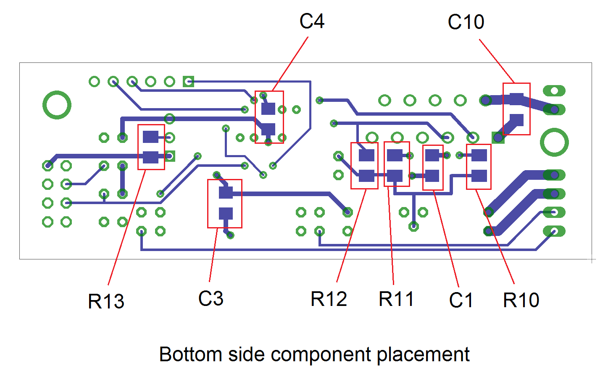
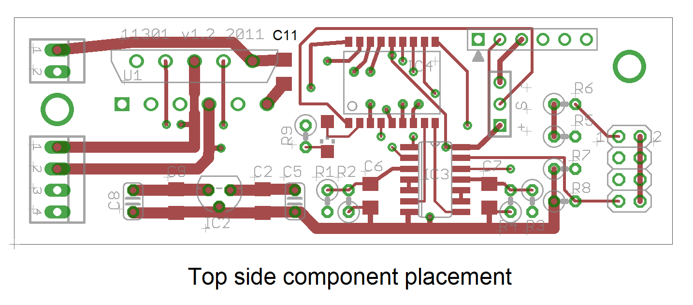

These are schematic and PCB layout files created in Eagle PCB.

Eagle schematic: singleAxisMotor3.sch (Matt Moses)   
Eagle PCB layout: singleAxisMotor3.brd (Matt Moses)   
Custom part library 1: custom.lbr (Matt Moses)   
Custom part library 2: modular_robot_parts.lbr (Kevin Wolfe)   

